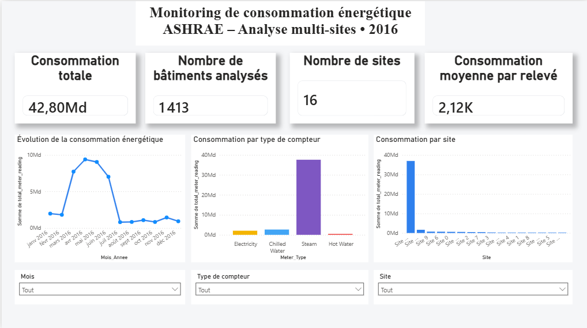

# Energy Consumption Monitoring Pipeline

Pipeline **Data Engineering end-to-end** construit à partir du dataset **ASHRAE – Great Energy Predictor III**.

L’objectif du projet est de concevoir une chaîne de traitement reproductible permettant de **valider, ingérer, stocker, contrôler, transformer, orchestrer et analyser** des données de consommation énergétique multi-sites.

Le projet combine **GCP, BigQuery, dbt, Apache Airflow, PySpark, Docker, CI/CD et Power BI** afin de reproduire les principales briques d’une plateforme Data moderne.

---

## Architecture

```text
                         ASHRAE CSV
                             │
                             ▼
                      Validation Python
                             │
                             ▼
                  Google Cloud Storage
                             │
                             ▼
                      BigQuery RAW
                             │
                             ▼
                      Data Quality
                             │
                  ┌──────────┴──────────┐
                  │                     │
                  ▼                     ▼
               PySpark                 dbt
          traitement batch       STAGING + MARTS
                  │                     │
                  ▼                     ▼
               Parquet          BigQuery Analytics
                                        │
                                        ▼
                                   Power BI
```

**Apache Airflow** orchestre l’exécution des différentes étapes du pipeline.

Le pipeline est conteneurisé avec **Docker / Docker Compose** et utilise **PostgreSQL** comme base de métadonnées Airflow.

---

## Stack technique

### Data Engineering

- Python
- SQL
- PySpark
- Apache Spark
- Apache Airflow
- dbt

### Cloud & Data Warehouse

- Google Cloud Platform
- Google Cloud Storage
- BigQuery

### Infrastructure & industrialisation

- Docker
- Docker Compose
- PostgreSQL
- Git
- GitHub
- GitHub Actions
- pytest

### Data Visualisation

- Power BI

---

## Dataset

Le projet utilise le dataset **ASHRAE – Great Energy Predictor III**.

Sources principales utilisées :

- `building_metadata.csv`
- `weather_train.csv`
- `train.csv`

### Volumétrie

```text
building_metadata :      1 449 lignes
weather_train      :    139 773 lignes
train               : 20 216 100 lignes
```

Le dataset principal contient plus de **20 millions de mesures de consommation énergétique**.

La période analysée couvre l’année **2016**.

Le dataset comprend :

- 16 sites ;
- 1 449 bâtiments dans les métadonnées ;
- 4 types de compteurs ;
- des mesures horaires de consommation ;
- des données météorologiques associées aux sites.

Types de compteurs :

```text
0 → Electricity
1 → Chilled Water
2 → Steam
3 → Hot Water
```

---

## Pipeline Airflow

Le DAG `energy_pipeline` orchestre les étapes suivantes :

```text
start
  │
  ▼
validate_sources
  │
  ▼
ingest_to_gcs
  │
  ▼
load_to_bigquery
  │
  ▼
check_bigquery_data
  │
  ▼
spark_processing
  │
  ▼
dbt_build
  │
  ▼
end
```

Cette orchestration permet de contrôler les dépendances entre les différentes briques et d’empêcher l’exécution des traitements en aval lorsqu’une étape critique échoue.

---

## 1. Validation des sources

Avant toute ingestion, les fichiers CSV sont contrôlés avec Python.

Les contrôles vérifient notamment :

- la présence du fichier ;
- l’absence de fichier vide ;
- la présence des colonnes attendues.

Le pipeline applique une stratégie **fail fast** : une source invalide empêche la poursuite du traitement.

Cette étape permet d’éviter de propager une anomalie source vers le stockage cloud et les couches analytiques.

---

## 2. Ingestion vers Google Cloud Storage

Les fichiers validés sont chargés dans :

```text
gs://time-series-data-pipeline-raw/ashrae/raw/
```

L’ingestion est **idempotente**.

Lorsqu’un objet existe déjà dans GCS avec la même taille que le fichier local, le transfert est ignoré afin d’éviter des uploads inutiles lors des réexécutions du pipeline.

---

## 3. Chargement BigQuery RAW

Les données sont chargées dans le dataset BigQuery :

```text
raw_ashrae
```

Tables :

- `building_metadata`
- `weather_train`
- `train`

Les tables contenant des données temporelles sont partitionnées quotidiennement sur `timestamp`.

Pour ce snapshot statique, le chargement RAW utilise :

```text
WRITE_TRUNCATE
```

Ce choix rend les réexécutions reproductibles et évite la duplication des données.

---

## 4. Data Quality

Plusieurs contrôles de qualité sont appliqués :

- valeurs manquantes ;
- doublons ;
- validité des valeurs ;
- intégrité référentielle ;
- continuité temporelle ;
- volumétrie attendue.

L’audit a notamment identifié des **gaps temporels** dans certaines séries météo et consommation.

Ces gaps sont considérés comme des caractéristiques des données sources et non automatiquement comme des erreurs du pipeline.

Un contrôle post-chargement vérifie également les volumes présents dans BigQuery.

Volumes attendus :

```text
building_metadata :      1 449
weather_train      :    139 773
train               : 20 216 100
```

Le pipeline échoue si les volumes chargés ne correspondent pas aux volumes attendus.

---

## 5. Traitement PySpark

Une étape PySpark a été intégrée afin de traiter les **20+ millions de mesures** du dataset principal et de mettre en pratique les mécanismes de traitement parallèle de Spark.

Le traitement réalise :

```text
train.csv
     │
     │
     ├──────────────────┐
     │                  │
     ▼                  ▼
Mesures          building_metadata
     │                  │
     └────── JOIN ──────┘
                │
                ▼
       Enrichissement site
                │
                ▼
       Création de la date
                │
                ▼
  groupBy(site_id, meter, date)
                │
                ▼
       SUM(meter_reading)
                │
                ▼
         Parquet + Snappy
```

### Broadcast Join

`building_metadata` contient seulement **1 449 lignes**, contre plus de **20 millions** pour `train.csv`.

La petite table est donc diffusée avec :

```python
broadcast(building_df)
```

Cette stratégie permet d’éviter un shuffle inutile de la grande table lors de la jointure.

Le plan physique Spark est contrôlé avec :

```python
energy_df.explain()
```

L’exécution a permis de confirmer l’utilisation d’un :

```text
BroadcastHashJoin
```

### Agrégation

Les données sont agrégées par :

```text
site_id
meter
date
```

Le type de compteur `meter` est conservé afin de ne pas mélanger directement des mesures provenant de compteurs pouvant représenter des grandeurs ou unités différentes.

### Sortie Parquet

Le résultat est écrit au format :

```text
Parquet + Snappy
```

dans :

```text
data/processed/spark/daily_site_meter_consumption/
```

Parquet fournit un stockage colonne adapté aux traitements analytiques et limite les volumes à lire lorsque seules certaines colonnes sont nécessaires.

### Conteneurisation Spark

Le job Spark est exécuté dans un environnement Linux reproductible avec Docker.

Image utilisée :

```text
spark:4.2.0-python3
```

Le traitement est actuellement exécuté avec :

```text
local[*]
```

Spark utilise donc les cœurs disponibles de la machine locale. Le projet met en œuvre l’API et les mécanismes de traitement Spark, sans prétendre exécuter actuellement le job sur un cluster multi-nœuds.

Le job PySpark est également intégré directement au DAG Airflow.

---

## 6. Transformations dbt

dbt transforme les données RAW en modèles analytiques.

### STAGING

- `stg_building_metadata`
- `stg_weather`
- `stg_train`

### MARTS

- `mart_energy_consumption`
- `mart_daily_site_consumption`

Les modèles et tests sont exécutés avec :

```bash
dbt build
```

Résultat validé :

```text
PASS=34
WARN=0
ERROR=0
SKIP=0
TOTAL=34
```

Le mart `mart_daily_site_consumption` sert notamment de source au dashboard Power BI.

---

## 7. Orchestration Airflow

Airflow est exécuté dans Docker avec **PostgreSQL 16** comme base de métadonnées.

Le pipeline gère :

- les dépendances entre les tâches ;
- les logs ;
- les statuts d’exécution ;
- les retries ;
- le blocage des traitements en aval en cas d’échec ;
- l’exécution du job PySpark ;
- le déclenchement de dbt.

Le dataset ASHRAE utilisé étant un snapshot statique, le DAG est actuellement configuré avec :

```python
schedule=None
```

Une planification automatique a également été testée afin de valider le mécanisme de scheduling Airflow.

L’exécution **end-to-end du DAG**, y compris la tâche PySpark et la construction des modèles dbt, a été validée.

---

## 8. Monitoring

Une étape de monitoring vérifie les données chargées dans BigQuery avant la poursuite du pipeline.

Elle contrôle notamment la présence des tables et leurs nombres de lignes.

Les volumes attendus sont comparés aux volumes réellement chargés afin de détecter rapidement :

- un chargement incomplet ;
- une table vide ;
- une anomalie de volumétrie.

Le monitoring est intégré directement au DAG :

```text
load_to_bigquery
        │
        ▼
check_bigquery_data
        │
        ▼
spark_processing
```

---

## 9. Dashboard Power BI

Un dashboard Power BI a été construit à partir du mart :

```text
mart_daily_site_consumption
```

Fichier Power BI :

```text
dashboards/energy_consumption_dashboard.pbix
```

Le dashboard permet d’explorer la consommation énergétique multi-sites sur l’année 2016.

### Aperçu du dashboard



### KPI

Le tableau de bord présente :

- la consommation totale ;
- le nombre de bâtiments analysés ;
- le nombre de sites ;
- la consommation moyenne par relevé.

Le périmètre analytique contient **1 413 bâtiments présents dans les données de consommation analysées**, contre 1 449 bâtiments dans les métadonnées sources.

### Visualisations

Le dashboard contient :

- l’évolution mensuelle de la consommation énergétique ;
- la consommation par type de compteur ;
- la consommation par site.

Les types de compteurs sont distingués visuellement :

- Electricity ;
- Chilled Water ;
- Steam ;
- Hot Water.

### Filtres interactifs

Les analyses peuvent être filtrées par :

- mois ;
- type de compteur ;
- site.

Les filtres mettent automatiquement à jour les KPI et les graphiques.

### Mesure DAX

Une mesure pondérée est utilisée pour calculer la consommation moyenne par relevé :

```DAX
Consommation_Moyenne =
DIVIDE(
    SUM('mart_daily_site_consumption'[total_meter_reading]),
    SUM('mart_daily_site_consumption'[reading_count])
)
```

Cette approche évite de calculer une moyenne simple à partir de moyennes déjà agrégées.

> **Note d’interprétation :** les différents types de compteurs peuvent représenter des grandeurs ou unités différentes. Les comparaisons de valeurs absolues entre types de compteurs doivent donc être interprétées avec prudence.

---

## 10. Sécurité GCP et IAM

Le pipeline utilise un service account dédié :

```text
energy-pipeline@time-series-data-pipeline.iam.gserviceaccount.com
```

Les permissions sont limitées aux ressources nécessaires au pipeline.

```text
GCS bucket
└── accès aux objets et métadonnées nécessaires

BigQuery project
└── BigQuery Job User

BigQuery raw_ashrae
└── BigQuery Data Editor

BigQuery analytics
└── BigQuery Data Editor
```

En environnement local, Airflow utilise **Application Default Credentials (ADC)** avec **service account impersonation**.

```text
Airflow / Docker
        │
        ▼
       ADC
        │
        ▼
Service Account Impersonation
        │
        ▼
energy-pipeline
        │
        ▼
   GCS + BigQuery
```

Cette approche évite de stocker une clé privée permanente du service account dans le projet ou dans Git.

Dans un environnement de production GCP, une identité de service attachée directement au runtime serait privilégiée.

---

## 11. Tests automatisés

Les fonctions de validation des sources sont couvertes par des tests unitaires avec `pytest`.

Les tests couvrent notamment :

- fichier présent ;
- fichier absent ;
- fichier vide ;
- fichier non vide ;
- schéma valide ;
- colonne manquante ;
- échec global de validation ;
- succès global de validation.

Résultat :

```text
8 tests passed
```

---

## 12. CI avec GitHub Actions

Une pipeline CI est configurée avec **GitHub Actions**.

À chaque push ou pull request vers `main`, GitHub Actions :

1. récupère le dépôt ;
2. configure Python 3.12 ;
3. installe les dépendances ;
4. exécute les tests unitaires.

Commande utilisée :

```bash
python -m pytest tests/ -v
```

Les tests nécessitant une authentification GCP sont séparés des tests unitaires afin que la CI ne dépende pas de credentials personnels.

---

## Exécution locale

### Environnement Python

Sous Windows PowerShell :

```powershell
.\.venv\Scripts\Activate.ps1
```

Installation des dépendances :

```powershell
python -m pip install -r requirements.txt
```

### Airflow

L’environnement Airflow peut être lancé avec :

```bash
docker compose up -d
```

Vérification des conteneurs :

```bash
docker compose ps
```

Interface Airflow :

```text
http://localhost:8080
```

Arrêt :

```bash
docker compose down
```

### PySpark

Le traitement Spark peut être exécuté avec :

```bash
spark-submit --master local[*] src/spark/aggregate_energy.py
```

Dans le pipeline complet, cette étape est déclenchée automatiquement par Airflow.

---

## Structure du projet

```text
time-series-data-pipeline/
│
├── .github/
│   └── workflows/
│       └── ci.yml
│
├── airflow/
│   └── dags/
│       └── energy_pipeline_dag.py
│
├── dashboards/
│   └── energy_consumption_dashboard.pbix
│
├── data/
│   ├── raw/
│   └── processed/
│       └── spark/
│
├── dbt/
│   └── energy_pipeline/
│
├── docker/
│   ├── airflow/
│   │   └── Dockerfile
│   └── spark/
│       └── Dockerfile
│
├── docs/
│   └── screenshots/
│       └── powerbi_dashboard.png
│
├── sql/
│   └── data_quality/
│
├── src/
│   ├── ingestion/
│   │   ├── ingest_data.py
│   │   ├── load_to_bigquery.py
│   │   ├── test_gcs_connection.py
│   │   └── validate_sources.py
│   │
│   ├── monitoring/
│   │   └── check_bigquery_data.py
│   │
│   └── spark/
│       ├── aggregate_energy.py
│       └── verify_parquet.py
│
├── tests/
│   └── test_validate_sources.py
│
├── docker-compose.yml
├── requirements.txt
└── README.md
```

Les données brutes, données intermédiaires volumineuses, environnements virtuels, secrets et credentials ne sont pas versionnés.

---

## Principes Data Engineering démontrés

Ce projet met en pratique plusieurs concepts importants de Data Engineering :

- pipeline end-to-end ;
- séparation RAW / STAGING / MARTS ;
- ingestion idempotente ;
- stratégie fail fast ;
- Data Quality ;
- partitionnement BigQuery ;
- transformations SQL avec dbt ;
- tests de données ;
- orchestration Airflow ;
- monitoring ;
- traitement batch avec PySpark ;
- broadcast join ;
- réduction des shuffles inutiles ;
- stockage colonne avec Parquet ;
- conteneurisation ;
- IAM et principe du moindre privilège ;
- service account impersonation ;
- tests unitaires ;
- CI avec GitHub Actions ;
- restitution analytique avec Power BI.

---

## Résultat

Le projet permet de passer de fichiers CSV bruts à une chaîne Data Engineering complète :

```text
Sources
   │
   ▼
Validation
   │
   ▼
Cloud Storage
   │
   ▼
BigQuery RAW
   │
   ▼
Data Quality
   │
   ├─────────────► PySpark ─────► Parquet
   │
   ▼
dbt
   │
   ▼
BigQuery Analytics
   │
   ▼
Power BI
```

L’ensemble est orchestré avec **Airflow**, conteneurisé avec **Docker**, sécurisé avec **GCP IAM** et testé automatiquement avec **pytest**, **dbt tests** et **GitHub Actions**.

---

## État du projet

### Implémenté

- [x] audit des données
- [x] validation des sources
- [x] ingestion Google Cloud Storage
- [x] chargement BigQuery RAW
- [x] contrôles Data Quality
- [x] transformations dbt
- [x] tests dbt
- [x] orchestration Airflow
- [x] monitoring BigQuery
- [x] tests unitaires
- [x] CI GitHub Actions
- [x] IAM et service account impersonation
- [x] traitement PySpark
- [x] broadcast join
- [x] sortie Parquet
- [x] intégration PySpark dans Airflow
- [x] dashboard Power BI
- [x] KPI et filtres interactifs
- [x] documentation technique

### Améliorations possibles

- déployer l’orchestration sur une infrastructure cloud managée ;
- mettre en place une ingestion incrémentale sur une source évolutive ;
- ajouter davantage de métriques d’observabilité ;
- mettre en place des alertes de production ;
- exécuter Spark sur un véritable cluster distribué ;
- ajouter une couche Infrastructure as Code ;
- renforcer les tests d’intégration cloud.

---

## Compétences démontrées

```text
Python          SQL             BigQuery
GCS             dbt             Airflow
PySpark         Spark           Parquet
Docker          PostgreSQL      Power BI
pytest          GitHub Actions  CI/CD
GCP IAM         Data Quality    Data Modeling
```

Ce projet a été réalisé dans une démarche de montée en compétences en **Data Engineering**, avec une attention particulière portée à la **qualité des données, l’orchestration, la reproductibilité, la sécurité et le passage à l’échelle**.